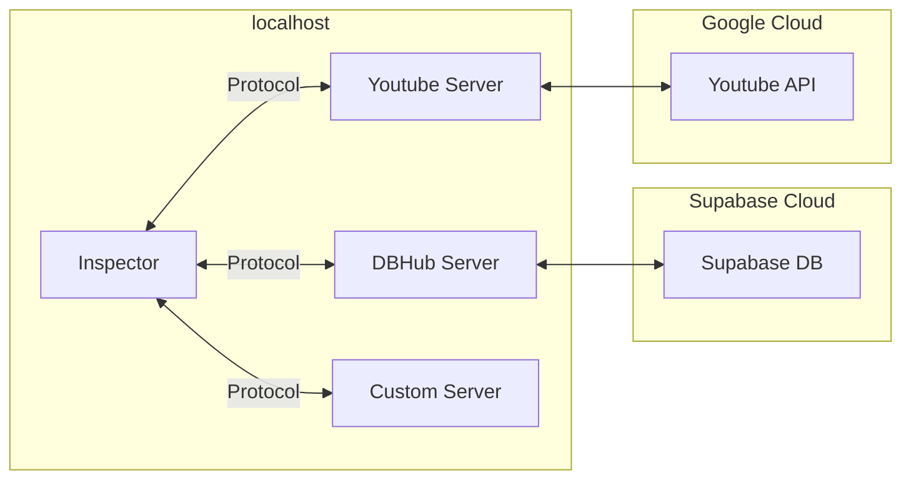
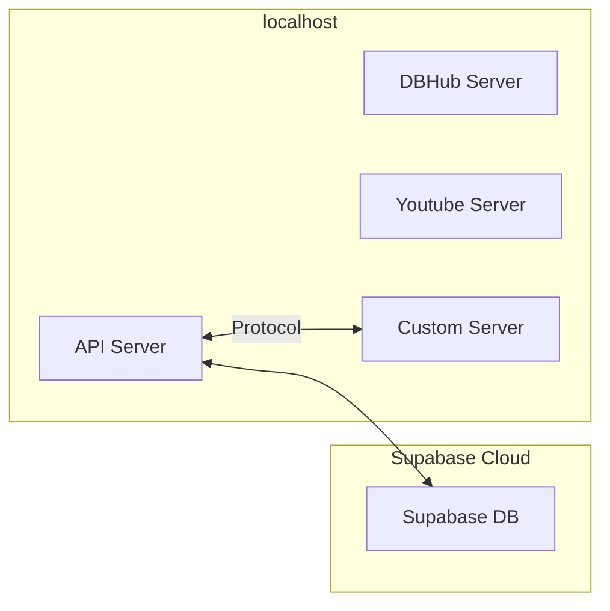
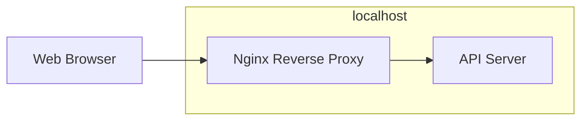
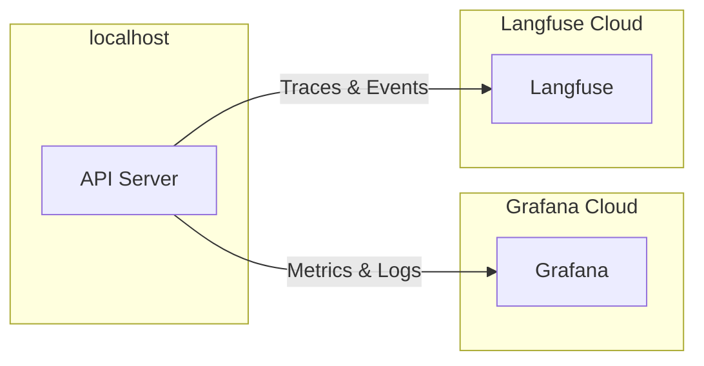

[](https://mseep.ai/app/nicholasgoh-fastapi-mcp-langgraph-template)

# FastAPI MCP LangGraph Template

A modern template for agentic orchestration — built for rapid iteration and scalable deployment using highly customizable, community-supported tools like MCP, LangGraph, and more.

Visit the Github: [](https://github.com/NicholasGoh/fastapi-mcp-langgraph-template) [](https://github.com/NicholasGoh/fastapi-mcp-langgraph-template)

> [!NOTE]
> Read the docs with demo videos [here](https://nicholas-goh.com/docs/intro?ref=fastapi-mcp-langgraph-template). This repo will not contain demo videos.

<!--toc:start-->
- [FastAPI MCP LangGraph Template](#fastapi-mcp-langgraph-template)
  - [Core Features](#core-features)
    - [Technology Stack and Features](#technology-stack-and-features)
    - [Planned Features](#planned-features)
  - [Architecture](#architecture)
    - [Inspector](#inspector)
    - [Template Setup](#template-setup)
    - [Reverse Proxy](#reverse-proxy)
    - [Planned Features Diagrams](#planned-features-diagrams)
      - [Monitoring and Observability](#monitoring-and-observability)
      - [Authentication and Authorization](#authentication-and-authorization)
  - [Quick Start](#quick-start)
  - [Development](#development)
    - [VSCode Devcontainer](#vscode-devcontainer)
    - [Without VSCode Devcontainer](#without-vscode-devcontainer)
  - [Debugging](#debugging)
  - [Refactored Markdown Files](#refactored-markdown-files)
    - [MCP](#mcp)
    - [LangGraph](#langgraph)
    - [Supabase](#supabase)
    - [Langfuse](#langfuse)
    - [Grafana Stack](#grafana-stack)
<!--toc:end-->

## Core Features

[](https://github.com/modelcontextprotocol/python-sdk) is an open protocol that standardizes how apps provide context to LLMs.
  - Seamlessly integrates LLM with growing list of community integrations found here [](https://github.com/modelcontextprotocol/servers)
  - No LLM provider lock in

[](https://github.com/langchain-ai/langgraph) for Customizable Agentic Orchestration
- Native streaming for UX in complex Agentic Workflows
- Native persisted chat history and state management

### Technology Stack and Features

- [](https://github.com/fastapi/fastapi) for Python backend API
- [](https://github.com/fastapi/sqlmodel) for Python SQL database interactions (ORM + Validation).
  - Wrapper of [](https://github.com/sqlalchemy/sqlalchemy)
- [](https://github.com/langfuse/langfuse) for LLM Observability and LLM Metrics
- [](https://github.com/pydantic/pydantic) for Data Validation and Settings Management.
- [](https://github.com/supabase/supabase) for DB RBAC
  - [](https://github.com/postgres/postgres) Relational DB
  - [](https://github.com/pgvector/pgvector) Vector Store
- [](https://github.com/nginx/nginx) Reverse Proxy
- [](https://github.com/docker/compose) for development and production.

### Planned Features

- [](https://github.com/prometheus/prometheus) for scraping Metrics
- [](https://github.com/grafana/grafana) for visualizing Metrics
- [](https://auth0.com/docs) SaaS for Authentication and Authorization with OIDC & JWT via OAuth 2.0
- CI/CD via Github Actions
  - :dollar: Deploy live demo to [](https://docs.aws.amazon.com/AmazonECS/latest/developerguide/AWS_Fargate.html)
  - Provision with [](https://github.com/hashicorp/terraform) IaC
  - Push built images to ECR and Dockerhub

## Architecture

This section outlines the architecture of the services, their interactions, and planned features.

### Inspector

Inspector communicates via SSE protocol with each MCP Server, while each server adheres to MCP specification.



### Template Setup

The current template does not connect to all MCP servers. Additionally, the API server communicates with the database using a SQL ORM.



### Reverse Proxy

Can be extended for other services like Frontend and/or certain backend services self-hosted instead of on cloud (e.g., Langfuse).



### Planned Features Diagrams

#### Monitoring and Observability



#### Authentication and Authorization


[Auth0 Source](https://auth0.com/docs/get-started/authentication-and-authorization-flow/authorization-code-flow)

## Quick Start

Setup to run the repository in both production and development environments.

Build community youtube MCP image with:

```bash
./community/youtube/build.sh
```

:::tip

Instead of cloning or submoduling the repository locally, then building the image, this script builds the Docker image inside a temporary Docker-in-Docker container. This approach avoids polluting your local environment with throwaway files by cleaning up everything once the container exits.

:::

Then build the other images with:

```bash
docker compose -f compose-dev.yaml build
```

Copy environment file:

```bash
cp .env.sample .env
```

Add your following API keys and value to the respective file: `./envs/backend.env`, `./envs/youtube.env` and `.env`.

```bash
OPENAI_API_KEY=sk-proj-...
POSTGRES_DSN=postgresql://postgres...

LANGFUSE_PUBLIC_KEY=pk-lf-...
LANGFUSE_SECRET_KEY=sk-lf-...
LANGFUSE_HOST=https://cloud.langfuse.com

ENVIRONMENT=production

YOUTUBE_API_KEY=...
```

Set environment variables in shell: (compatible with `bash` and `zsh`)

```bash
set -a; for env_file in ./envs/*; do source $env_file; done; set +a
```

Start production containers:

```bash
docker compose up -d
```

<ReactPlayer playing controls url='/vid/fastapi-mcp-langgraph-template/api.mp4' />

## Development

First, set environment variables as per above.

### VSCode Devcontainer

<ReactPlayer playing controls url='/vid/fastapi-mcp-langgraph-template/vscode.mp4' />

<br/>

:::warning

Only replace the following if you plan to start debugger for FastAPI server in VSCode.

:::

Replace `./compose-dev.yaml` entrypoint to allow debugging FastAPI server:

```yaml title="./compose-dev.yaml"
  api:
    image: api:prod
    build:
      dockerfile: ./backend/api/Dockerfile
    # highlight-next-line
    entrypoint: bash -c "sleep infinity"
    env_file:
      - ./envs/backend.env
```

Then:

```bash
code --no-sandbox .
```

Press `F1` and type `Dev Containers: Rebuild and Reopen in Container` to open containerized environment with IntelliSense and Debugger for FastAPI.

### Without VSCode Devcontainer

Run development environment with:

```bash
docker compose -f compose-dev.yaml up -d
```

## Debugging

Sometimes in development, nginx reverse proxy needs to reload its config to route services properly.

```bash
docker compose -f compose-dev.yaml exec nginx sh -c "nginx -s reload"
```

## Refactored Markdown Files

The following markdown files provide additional details on other features:

### MCP

[`./docs/mcp.md`](./docs/mcp.md)

### LangGraph

[`./docs/langgraph.md`](./docs/langgraph.md)

### Supabase

[`./docs/supabase.md`](./docs/supabase.md)

### Langfuse

[`./docs/langfuse.md`](./docs/langfuse.md)

### Grafana Stack

[`./docs/grafana-stack.md`](./docs/grafana-stack.md)

[](https://www.star-history.com/#nicholasgoh/fastapi-mcp-langgraph-template&Date)

> [!NOTE]
> Click above to view live update on star history as per their [article](https://www.star-history.com/blog/a-message-to-github-star-history-users):
> Ongoing Broken Live Chart
> you can still use this website to view and download charts (though you may need to provide your own token).
